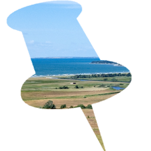
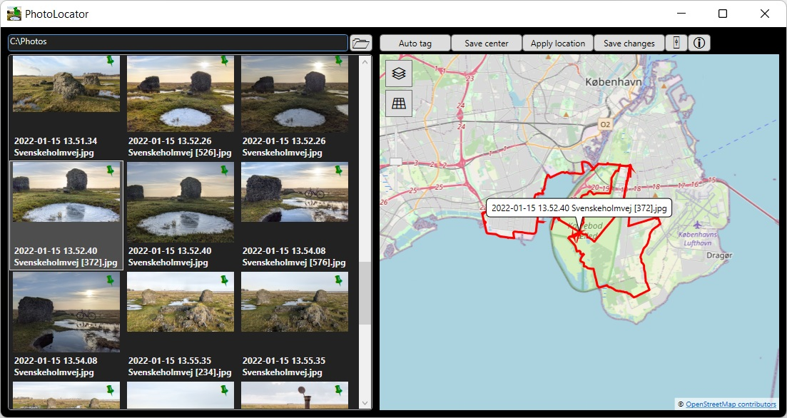
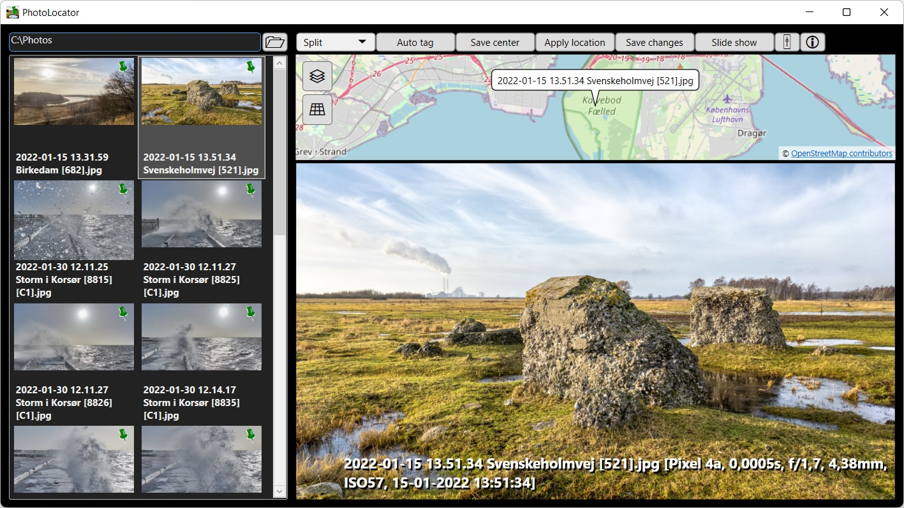
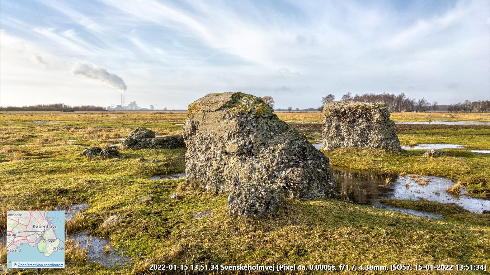

# PhotoLocator

## Photo geotagging and location browsing
PhotoLocator can import GPS traces from GPX and KML files and then apply the GPS positions to JPEG files by synchronizing with
the photo timestamps. GPS tags can also be imported from other already geotagged photos.
The locations can either be set automatically based on timestamps or manually by copy/pasting from other files or selecting on the map.
PhotoLocator can perfom a lossless update of the EXIF data in the target files directly or in copies of the files.

KML files can be obtained directly from the Google maps location history. GPX files can be exported by many location and sports tracking apps. 

## JPEG, raw and video file preview
PhotoLocator can also preview JPEG, raw and video files and you can delete unwanted files. Note that to be able to preview 
some raw image formats you need to install the Raw Image Extension from the Microsoft Store.

## Mask based automatic renaming
Selected files can be automatically renamed based on timestamp, dimensions and other metadata tags.

## Slideshow with location map
There is also a full screen slideshow feature with a small location map display. The slideshow can also play video files.
You can drag/drop in files and folders to do a slideshow across multiple folders. 

Note that it is possible to use Chrome's full screen cast feature to display the slideshow on a TV with Chromecast.

## Troubleshooting
If PhotoLocator cannot start, you need to install the .NET 6 Desktop Runtime.

## Why PhotoLocator?
I have been using GeoSetter for many years but it has not been maintained for a long time and then it completely stopped working 
for me. Since I was unable to find a suitable replacement I decided to make a new geotagging application and make it open source.

## Version history
https://github.com/meesoft/PhotoLocator/releases

## Source code
PhotoLocator is written in C# targeting .net6.0 for Windows.

The source code is available at https://github.com/meesoft/PhotoLocator

Released binaries will be made available at http://meesoft.com/PhotoLocator

## License
[Ms-PL](LICENSE)
